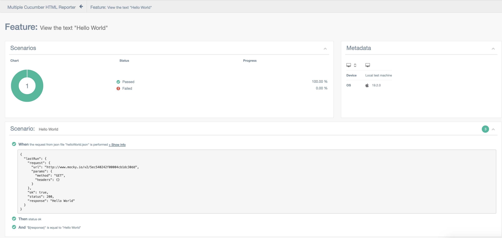

# MAF - Modular Automation Framework

An expandable fast, easy to use automation framework built in the cucumber language.  Supports AWS S3/DynamoDB, API Testing, UI Testing, SQL Testing in a simple manner.  Allows the usage of modules in isolation as well as in an integrated fashion.  Utilizes the cucumber language to clearly articulate intent while preserving test data for further debugging and record-keeping.

## Installation
Dependencies
- node
- yarn

Clone this project and run `yarn` from the root directory.  For the quickest start add the HelloWorld API example.  By default, the HelloWorldAPI and HelloWorldSQL dependencies are included.  For other dependencies, you will need to read the required steps in their respective READMEs.

## Hello World API Example

`./features/HelloWorldAPI.feature`
```
Feature: View the text "Hello World"
  Scenario: Hello World
    When api request "helloWorld.json" is performed
    Then status ok
    And "${response}" is equal to "Hello World"
```
`./helloWorld.json`
```
{
  "url": "http://www.mocky.io/v2/",
  "api": "5ec540242f00004cb1dc30dd",
  "method": "GET"
}
```

### The Generated report:
```
➜  cucumber-api git:(master) bash runFeature.sh helloWorld.feature
...

1 scenario (1 passed)
3 steps (3 passed)
0m00.360s


=====================================================================================
    Multiple Cucumber HTML report generated in:

    $HOME/cucumber-api/test/report/index.html
=====================================================================================
```




## Hello World SQL Example

This requires the setup of your sql environment.  To utilize this, please run `node sqlConfigure` and it will prompt you for needed credentials, etc. for SQL to run properly.    It will store the config in a `sqlConfig.json` file and it will store your credentials using `node-keytar` which uses your OS's secure password storage:
- Windows - Credential Vault
- MacOS - KeyChain
- Linux - libSecret

You will also need to update the sql query and update the validations to match.  You can copy the validations from the generated report to make sure it passes.

`features/HelloWorldSQL.feature`
```
Feature: SQL Hello World
  Scenario: Run a query
      When the query "SELECT * FROM HelloWorld" is run
      Then it matches set from the file "helloWorldSQL.json"
```
`./helloWorldSQL.json`
```
[
  {
    "id" : "1",
    "hello": "world"
  },
  {
    "id" : "2",
    "hello": "day"
  }
]
```
`Table HelloWorld`
```
| id | hello |
| 1  | world |
| 2  | day   |
```

## Included modules:
There are several included modules, below are links to the READMEs.  You can also find them in the projects directory.

[Validations](packages/validations/README.md) - This project contains helper cucumber steps and various ways of setting objects.  It additionally performs validations on some of the objects.  This would include things like `Then item "a" is equal to 5` and `When "Hello World" is base64 encoded`

[API](packages/api/README.md) - This project contains cucumber steps for performing API Calls.

[MySQL](packages/mysql/README.md) - This project contains cucumber steps for calling MYSQL.

[DefaultSql](packages/defaultSQL/README.md) - This project is used to create other sql modules.  Just implement what is in MySQL and read the README to get it set up.

[Core](packages/core/README.md) - This contains details about the core.  If you are attempting to set up your own cucumber steps it is a good place to start.  Specifically for the function `MAFWhen`.

[filltemplate](packages/filltemplate/README.md) - This contains details on how the parsing of template literals is done.  There are some slight changes over the default.  This is needed to provide easy access to variables within strings.

## Variable usage
Variables can be used within almost any step.  These can be used as follows:

Feature: Variable example with api
## Hello World API Example

`./features/HelloWorldAPI.feature`
```
Feature: View the text "Hello World"
  Scenario: Hello World
    Given set "url" to "https://mocky.io"
    Given set "exampleLiteral" to "${5+5}Works?"
    When api request "helloWorld.json" is performed
    Then status ok
    And "${response}" is equal to "Hello World"
```
`./helloWorld.json`
```
{
  "url": "${url}",
  "api": "5ec540242f00004cb1dc30dd",
  "method": "GET"
}
```

## Add a module
Please view [AddModule](./AddModule.md) for information on how to add a module.  This will allow the creation of new steps that can be used in your project.
